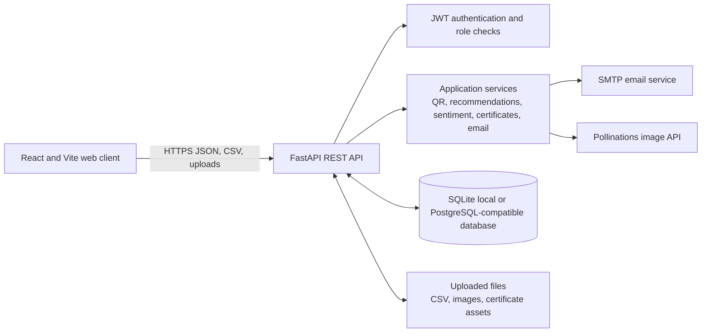
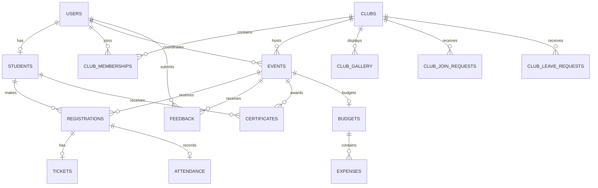

# University Event Management and Engagement Platform

**Project Name:** University Event Management and Engagement Platform (Brainware University Portal)

## 1. Problem Statement

University events are often planned and managed through disconnected forms, spreadsheets, email, and paper attendance lists. This makes it difficult to coordinate approvals, communicate with students, track registrations and attendance, manage club membership, reconcile event expenses, and issue certificates. Students may also have trouble finding events and clubs relevant to them.

## 2. Target Users

- **Students:** discover events, register, access QR tickets, join clubs, submit feedback, and view certificates.
- **Faculty and mentors:** participate in permitted student-facing event and club workflows.
- **Department coordinators:** schedule and manage events, oversee department-related workflows, check in attendees, and submit event results.
- **Club coordinators and club officers:** manage club members, requests, galleries, and club activities according to assigned permissions.
- **Finance staff:** review event budgets and uploaded expense reports.
- **Administrators:** manage users, clubs, departments, roles, event approval, and system-wide requests.

Access to dashboards and actions is role- and permission-based.

## 3. Objectives

1. Provide one portal for university events and club engagement.
2. Make event scheduling, review, approval, publication, and completion traceable.
3. Give students a clear way to discover events, register, and retrieve tickets.
4. Replace manual attendance counting with QR check-in and downloadable reports.
5. Support club membership, join/leave requests, and officer permissions.
6. Track proposed budgets and submitted expenses through finance workflows.
7. Provide participation analytics, feedback summaries, and certificates.
8. Present the workflows through a consistent responsive interface.

## 4. Proposed Solution

The application is a React single-page portal backed by a FastAPI REST API. The backend applies authentication and role checks, stores university data through SQLAlchemy, and coordinates event, registration, attendance, finance, club, feedback, and certificate workflows. Separate dashboards present the actions available to each role. SQLite is supported for local development; a PostgreSQL-compatible database can be configured for deployment.

## 5. Features

- Login and password change/reset. Users sign in with credentials provisioned by an administrator or coordinator; public self-registration is disabled.
- Role-aware student and administration dashboards.
- Event listing, scheduling, editing, deletion, and lifecycle status tracking.
- Event approval workflow that includes finance review and coordinator publication.
- Event registration, capacity handling, and QR ticket generation.
- QR check-in and attendance export/import by CSV.
- Final-results CSV upload and certificate generation/publication.
- Club directory, membership, join/leave requests, officer roles, and role permissions.
- Club galleries and member CSV import/export.
- Event budget proposals, approval, required expense CSV submission, and expense verification.
- Participation analytics and event feedback collection.
- User, department, system-role, and profile management.

## 6. AI Features

- **Event recommendations:** the current recommendation service ranks published events using prior attendance at the same club and event registration/capacity fill. This is a deterministic scoring heuristic; it does not currently call a generative AI model.
- **Feedback sentiment:** feedback comments are analyzed as Positive, Negative, or Neutral when the local sentiment model is available. The service attempts to load `distilbert-base-uncased-finetuned-sst-2-english` from local files only. If Transformers or the model is unavailable, it records a Neutral fallback.
- **Certificate artwork:** an administrator or coordinator can request a blank certificate background from the Pollinations image API using a text prompt. The resulting artwork is stored with the event template.
- **Requirement suggestions:** the backend matches words in an event title/description to predefined accessory, guest, gift, and prize suggestions. Despite the UI's AI wording, the current endpoint is keyword-based and does not call an AI model/API.

## 7. Non-AI Features

Authentication, role/permission checks, CRUD operations, event workflow transitions, club management, registrations, QR generation/check-in, CSV processing, finance approval, PDF certificate generation, profile management, email delivery, and analytics aggregation are conventional application logic. QR ticket tokens are generated with Python's secure random token utility. Certificates are rendered to PDF with ReportLab.

## 8. Module Breakdown

| Module | Main responsibilities |
|---|---|
| Public access | Login and password recovery |
| Student portal | Discover events, recommendations, registration, tickets, clubs, feedback, certificates, profile |
| Event operations | Scheduling, editing, approval states, publishing, event completion |
| Attendance | QR scanning/check-in, attendance records, attendance CSV upload/export |
| Club management | Directory, memberships, officer roles, permissions, requests, gallery |
| User administration | Create/edit users, bulk user CSV, departments, system roles |
| Finance | Budget review, event expense CSV, verification, finance reports |
| Analytics | Participation summaries by department, gender, and time period |
| Certificates | Upload or generate artwork, create and publish certificate PDFs |
| Shared services | Authentication dependencies, email, database sessions, QR, sentiment, recommendations |

## 9. System Architecture

The frontend calls API routes grouped under `/api/auth`, `/api/events`, `/api/clubs`, `/api/admin`, `/api/coordinator`, `/api/finance`, `/api/attendance`, `/api/tickets`, `/api/certificates`, `/api/feedback`, `/api/analytics`, and `/api/profile`. The API returns JSON for application data and serves uploaded/generated files through configured static paths.

## 10. Database Design

The data layer uses SQLAlchemy models. The main entities and relationships are:

Principal tables include:

- **users, students, system_roles, departments** — identity, student-specific details, and permission configuration. An `account_requests` model remains in the schema for legacy data, but public account requests are disabled.
- **clubs, club_memberships, club_join_requests, club_leave_requests, club_gallery** — club information and participation.
- **events, registrations** — event details, lifecycle state, capacity, host/department, and attendee registration.
- **tickets, attendance, participation_ledger, certificates** — QR ticket references, check-in, participation credit, and issued awards.
- **budgets, expenses, feedback** — finance proposals and approvals, expense entries, ratings/comments, and sentiment labels.

Foreign keys connect the principal records. Some workflow or descriptive values (for example, event state and role configuration) are stored as enums, strings, or JSON. Review the SQLAlchemy models and migrations before making schema changes; field-level nullability and uniqueness rules are defined there.

## 11. Technology Stack

| Layer | Technologies in the repository |
|---|---|
| Frontend | React 18, Vite, React Router, Axios, plain CSS |
| UI and charts | lucide-react, Recharts |
| QR scanning | html5-qrcode in the browser |
| Backend | Python, FastAPI, Uvicorn, Pydantic |
| ORM and migrations | SQLAlchemy, Alembic |
| Database drivers | SQLite and psycopg2 for PostgreSQL-compatible databases |
| Auth and passwords | PyJWT, Passlib, bcrypt |
| Documents and images | qrcode, Pillow, ReportLab, python-multipart |
| Testing | pytest, FastAPI TestClient/httpx |
| Deployment configuration | Vercel static frontend and Python API build configuration |

The legacy account-request records are not linked to a `users` row by a foreign key in the current model.

## 12. AI Model/API

- **Sentiment model:** Hugging Face Transformers pipeline with `distilbert-base-uncased-finetuned-sst-2-english`, loaded with `local_files_only=True`. `transformers` is not listed in the current `backend/requirements.txt`; install/configure it and provision the model locally to enable inference. Otherwise the implemented fallback is Neutral.
- **Certificate background generation:** Pollinations image API (`https://image.pollinations.ai/prompt/...`) called by the backend. The current route makes a synchronous HTTP request and does not require an API key in its implementation. Network access and the third-party service are runtime dependencies.
- **Recommendations:** in-house scoring in `recommendation_service.py`; no external AI model/API is used.
- **AI requirement suggestions:** confirm the current `/api/admin/ai-recommend-requirements` implementation and whether it uses an external service before deployment; do not assume a particular provider from the UI label.

## 13. Data Sources

- User, student, department, club, and role information entered or imported by authorized university staff.
- Events and their budget/requirement details submitted by coordinators or faculty.
- Registrations, tickets, and attendance generated by student and check-in activity.
- Feedback ratings and comments submitted by users after completed events.
- Expense and attendance/result CSV files supplied through the portal.
- Certificate design prompts supplied by administrators or coordinators.
- Sentiment model weights provisioned locally, if the optional sentiment inference capability is enabled.
- Pollinations-generated certificate background images, when requested.

The platform does not need external sample event data to populate its core workflows; dashboards should use records from the configured database.

## 14. Expected Output

- Role-specific dashboards and event/club directories.
- Event schedules, statuses, approval records, and registration counts.
- Secure QR ticket images and event attendance/check-in records.
- Downloadable attendance, member, user, budget, and expense CSV files/templates as available in each module.
- Participation analytics charts and event feedback sentiment labels/summaries.
- Generated certificate PDFs and event certificate background templates.
- Finance approval and expense verification status for events.

## 15. Testing Strategy

### Current automated coverage

The repository contains a FastAPI health-check test at `backend/tests/test_health.py`. Frontend verification scripts include `npm run lint` and `npm run build`. Additional standalone backend scripts exist, but are not a replacement for repeatable automated tests.

### Recommended test plan

1. **Unit tests:** event state transitions, recommendation scoring, sentiment fallback/mapping, CSV parsing and validation, QR token generation, certificate rendering.
2. **API tests:** authentication, role denial/allowance, event create/update/publish/complete, registration capacity, club requests, finance approvals, file upload, and certificate publication.
3. **Frontend checks:** route access by role; form validation; loading, empty, error, and success states; dialog keyboard behavior.
4. **End-to-end workflows:** schedule → finance review → coordinator publish → student registration → QR check-in → results/expenses upload → verification → certificates.
5. **Responsive and accessibility review:** desktop/tablet/mobile layouts, keyboard-only navigation, focus visibility, labels, and table overflow.
6. **Regression checks:** `npm run lint`, `npm run build`, and backend pytest suite using a disposable test database and test configuration.

Tests that access a live database, email server, or external image API should use isolated fixtures or mocked services.

## 16. Security Considerations

- Require authentication for protected API routes and enforce authorization on the backend; hiding a frontend action alone is not authorization.
- Keep database credentials, SMTP credentials, and signing secrets in deployment environment variables. **The current `backend/app/core/security.py` contains a hard-coded development JWT secret; replace it with a strong secret from environment configuration before production.**
- Use HTTPS, secure token/session handling, password hashing, rate limits for login/reset, and short-lived/rotatable access credentials appropriate to deployment.
- Validate upload size, content type, CSV encoding/headers, and file names; store uploads outside executable/static code paths and use durable private object storage in production.
- Keep student profile, email, attendance, and feedback data access scoped to authorized roles; minimize personally identifiable data in analytics and logs.
- Review CORS origins, SQL errors, debug settings, and global exception responses before deployment. Production responses must not expose stack traces or secrets.
- Do not send confidential/student data to third-party AI/image services. Review the provider’s retention and usage terms and provide a non-AI fallback.
- Back up the database, use least-privilege database credentials, and review/audit destructive actions.
- Vercel functions use `/tmp` for some uploads in the current configuration; temporary files are not durable. Use persistent object storage for production uploads.

## 17. Deployment Plan

The repository includes a Vercel configuration for a static Vite frontend and Python API entry point. A deployment should:

1. Provision a managed PostgreSQL database and create a least-privilege connection string.
2. Configure backend database, JWT signing secret, SMTP, allowed frontend origins, and API base URL as environment variables.
3. Replace the hard-coded JWT secret and verify that production error handlers do not return traceback details.
4. Configure persistent object storage for uploaded profiles, galleries, attendance/expense CSVs, and certificate files instead of relying on serverless `/tmp`.
5. Install backend dependencies and confirm the optional AI model/service requirements; configure timeout and fallback behavior for external calls.
6. Run migrations, smoke tests, frontend lint/build, and role-based workflow checks in staging.
7. Deploy, verify API health and frontend/API connectivity, then enable backups and monitoring.

Exact production hostnames, storage provider, domain, and secrets are environment-specific and are not included in the repository documentation.

## 18. Team Members & Responsibilities

Names were not present in the repository. Replace the placeholders with the project team's actual names.

| Team member | Responsibility |
|---|---|
| To be assigned — Frontend | React pages, responsive design, role navigation, accessibility |
| To be assigned — Backend/API | FastAPI routes, validation, authorization, workflow logic |
| To be assigned — Database | SQLAlchemy models, migrations, seed/test data, backup plan |
| To be assigned — AI and integrations | Sentiment/recommendation evaluation, certificate image integration, email configuration |
| To be assigned — QA/Deployment | Automated and end-to-end testing, staging, deployment and monitoring |

For a smaller team, one person may own multiple responsibilities; record the actual owner and reviewer for each module.

## 19. One-Week Development Plan

| Day | Focus | Deliverable |
|---|---|---|
| 1 | Confirm requirements, role permissions, event lifecycle, data model, and deployment assumptions | Agreed scope, workflow diagram, task assignments |
| 2 | Implement/verify authentication, account onboarding, database schema, and core event APIs | Auth and event CRUD/validation with API tests |
| 3 | Complete coordinator/admin event scheduling, approvals, publishing, and club/user administration | Role-tested management flows |
| 4 | Complete student discovery, registration, tickets, club interactions, and feedback | Student end-to-end workflow |
| 5 | Complete QR attendance, CSV upload/export, finance budgets/expenses, and certificates | Operational and finance workflows |
| 6 | Integrate analytics/AI behavior, responsive UI, accessibility, and error/loading states | Integrated staging candidate; documented AI fallbacks |
| 7 | Run regression/security checks, fix critical issues, deploy staging/demo, and prepare user guide | Tested release candidate and presentation materials |

This is a one-week project plan, not a claim that every listed task remains incomplete; adjust it to match the team's actual progress and deadline.
